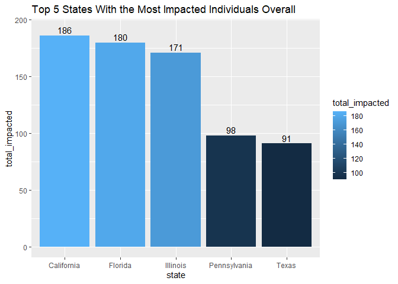

School Shootings Report
================
Alex Lam
5/19/2020

## School Shootings in 2018

### Summary:

> This report talks about the United States of America’s school
> shootings that occurred during the year 2018. There were a total of
> **340** school shootings that had unfortunately taken place that year.
> There were a total of **373** lives lost, with *Pompano Beach
> (Parkland)* city having the most casualities and *Trenton* city having
> the most injured. The state that had the most lives lost in 2018 was
> *California* state with **50** deaths. The table below outlines a
> summarized version of the tallied totals by death, injuries, and total
> impacted by state:

-----

### Total Death and Injuries by State

| state                | total\_deaths | total\_injuries | total\_impacted |
| :------------------- | ------------: | --------------: | --------------: |
| Alabama              |            12 |              55 |              67 |
| Arizona              |             4 |               5 |               9 |
| Arkansas             |             7 |              17 |              24 |
| California           |            50 |             136 |             186 |
| Colorado             |             9 |              27 |              36 |
| Connecticut          |             0 |               8 |               8 |
| Delaware             |             5 |               0 |               5 |
| District of Columbia |             2 |              23 |              25 |
| Florida              |            48 |             132 |             180 |
| Georgia              |             3 |              33 |              36 |
| Illinois             |            21 |             150 |             171 |
| Indiana              |            10 |              27 |              37 |
| Kansas               |             1 |              11 |              12 |
| Kentucky             |             7 |              25 |              32 |
| Louisiana            |            15 |              50 |              65 |
| Maryland             |            13 |              31 |              44 |
| Massachusetts        |             0 |               4 |               4 |
| Michigan             |            10 |              28 |              38 |
| Minnesota            |             1 |              14 |              15 |
| Mississippi          |             1 |              17 |              18 |
| Missouri             |            12 |              52 |              64 |
| Nebraska             |             1 |              16 |              17 |
| Nevada               |             3 |              15 |              18 |
| New Jersey           |             4 |              54 |              58 |
| New Mexico           |             5 |               4 |               9 |
| New York             |             5 |              53 |              58 |
| North Carolina       |            14 |              37 |              51 |
| Ohio                 |            13 |              46 |              59 |
| Oklahoma             |             2 |              19 |              21 |
| Pennsylvania         |            35 |              63 |              98 |
| South Carolina       |             5 |              19 |              24 |
| Tennessee            |            19 |              68 |              87 |
| Texas                |            29 |              62 |              91 |
| Utah                 |             0 |               4 |               4 |
| Virginia             |             2 |              17 |              19 |
| Washington           |             4 |               9 |              13 |
| Wisconsin            |             1 |              16 |              17 |

A Look at the table:

  - Although the numbers differ, there isn’t a coherent pattern to these
    incidents. This tragedy and loss of human life can happen
    *anywhere*, and that’s the sad truth. The total number of people
    that died were **373**.

  - The number of individuals impacted total up to be **1720**
    individuals. However, those numbers are only to those killed or
    injured, and don’t take account for their friends and family who
    lost someone.

-----

### Tragedy in Thousand Oaks, California.

> On *November 7, 2018* the city of *Thousand Oaks* would experience a
> tragedy among their youth. The incident happened at the *Borderline
> Bar and Grill*, a place for college students to enjoy their evenings,
> spend time with friends, and celebrate special occasions. The
> perpetrator, Ian D. Long, was a 28 year old who served in Afghanistan
> as a Marine Corp Veteran. That night, **13** people were killed, with
> **2** injured by Mr. Long’s actions. The devasting shooting totaled in
> ***15*** individuals who were impacted that night, with *13* of them
> losing their lives in a horrible incident.

*For more information on the California case, you can click [this site
here](https://www.nytimes.com/2018/11/08/us/shooting-california-thousand-oaks.html).*

-----

### Map of All Shootings During 2018

<!--html_preserve-->

<!--/html_preserve-->

The **size** of the circle markers on the map indicate the total impact;
the number of people killed and injured.

  - Eastern United States have unfortunately had many more shooting
    incidents happen than the Western United States **combined**.

  - *Pompano Beach (Parkland), Florida* had the highest number of
    fatalities and injuries, with **17 killed and 17 injured**.

### A Closer, Tragic Look

Below is a bar chart containing the data of the top 5 states that had
the most impacted individuals:

<!-- -->

As seen in the chart:

  - *California* and *Florida* have the **highest number total
    casualities and injured**, with both states being completely
    opposite of each other

  - *California* has over ***double the number*** of individuals who
    were killed and injured compared to Texas, with Florida being nearly
    double as well.

A question I posed to myself was *"Was there any rhyme or reason to all
of this? Was there a pattern that can be formed to help prevent these
shootings from killing and injuring loved ones?* I decided to create
this chart to try and make sense of it all, and I was able to find my
answer: There isn’t a pattern. As stated before, I talked about how
looking at the table above really puts into perspective that there these
horrible acts of violence can truly happen anywhere. The top 5 states
have nothing to do with each other and are fairly spread out across the
United States, and as such, there is nothing about the location that can
really connect with each other. They are just horrendous acts of
violence that we can only hope to prevent from harming our loved ones
further.
